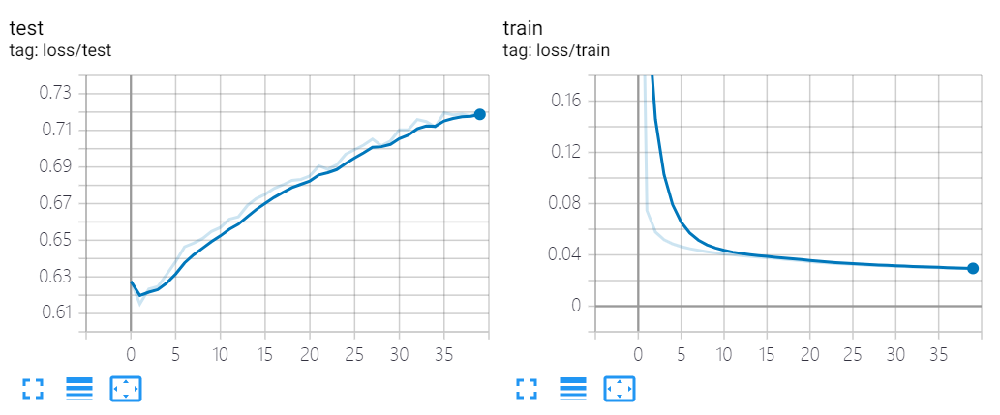
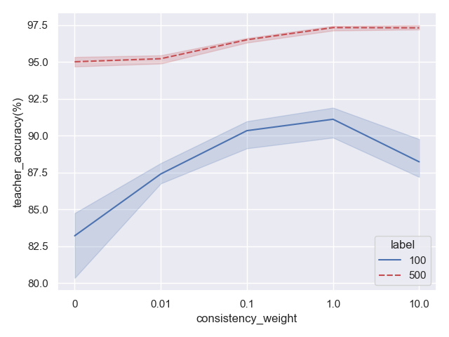

DeSSL.trainer package
========================

Submodules
----------

DeSSL.trainer.AdversariallyLearnedInference module
-----------------------------------------------------

.. automodule:: DeSSL.trainer.AdversariallyLearnedInference
   :members:
   :undoc-members:
   :show-inheritance:

DeSSL.trainer.InterpolationConsistency module
------------------------------------------------

.. automodule:: DeSSL.trainer.InterpolationConsistency
   :members:
   :undoc-members:
   :show-inheritance:

DeSSL.trainer.Ladder module
------------------------------

.. automodule:: DeSSL.trainer.Ladder
   :members:
   :undoc-members:
   :show-inheritance:

   The result of training LeNet-5 by the Ladder algorithm with 100 labeled images on MNIST Dataset.  

DeSSL.trainer.MeanTeacher module
-----------------------------------

.. automodule:: DeSSL.trainer.MeanTeacher
   :members:
   :undoc-members:
   :show-inheritance:

   +----------------------------+-----------------------------+---------------------------------------------------------+
   | The result of training LeNet-5 by Mean Teacher(consistency_weight) with 100/500 labeled images on MNIST Dataset.   |
   +============================+=============================+=========================================================+
   | Mean Accuracy(Three Trials)| 100                         | 500                                                     |
   +----------------------------+-----------------------------+---------------------------------------------------------+
   | Mean Teacher(10.0)         | 88.22(89.76 87.19 87.71)    | 97.31(97.19 97.25 97.48)                                |
   +----------------------------+-----------------------------+---------------------------------------------------------+
   | Mean Teacher(1.0)          | 91.11(91.57 91.89 89.86)    | 97.32(97.44 97.41 97.12)                                |
   +----------------------------+-----------------------------+---------------------------------------------------------+
   | Mean Teacher(0.1)          | 90.33(89.13 90.90 90.97)    | 96.5(96.30 96.61 96.58)                                 |
   +----------------------------+-----------------------------+---------------------------------------------------------+
   | Mean Teacher(0.01)         | 87.4(86.75 87.31 88.13)     | 95.21(95.44 94.88 95.32)                                |
   +----------------------------+-----------------------------+---------------------------------------------------------+
   | Only EMA                   | 83.2(84.74 80.34 84.53)     | 95.01(94.68 94.70 95.64)                                |
   +----------------------------+-----------------------------+---------------------------------------------------------+
   | LeNet-5(with BN)           | 80.87(78.07 81.45 83.08)    | 94.69(95.16 94.22 94.69)                                |
   +----------------------------+-----------------------------+---------------------------------------------------------+

   The result of training LeNet-5 by the Mean Teacher with 100/500 labeled images on MNIST Dataset.  

DeSSL.trainer.MixMatch module
--------------------------------

.. automodule:: DeSSL.trainer.MixMatch
   :members:
   :undoc-members:
   :show-inheritance:

DeSSL.trainer.VariationalAutoEncoder module
----------------------------------------------

.. automodule:: DeSSL.trainer.VariationalAutoEncoder
   :members:
   :undoc-members:
   :show-inheritance:

DeSSL.trainer.utils module
-----------------------------

.. automodule:: DeSSL.trainer.utils
   :members:
   :undoc-members:
   :show-inheritance:

Module contents
---------------

.. automodule:: DeSSL.trainer
   :members:
   :undoc-members:
   :show-inheritance:
